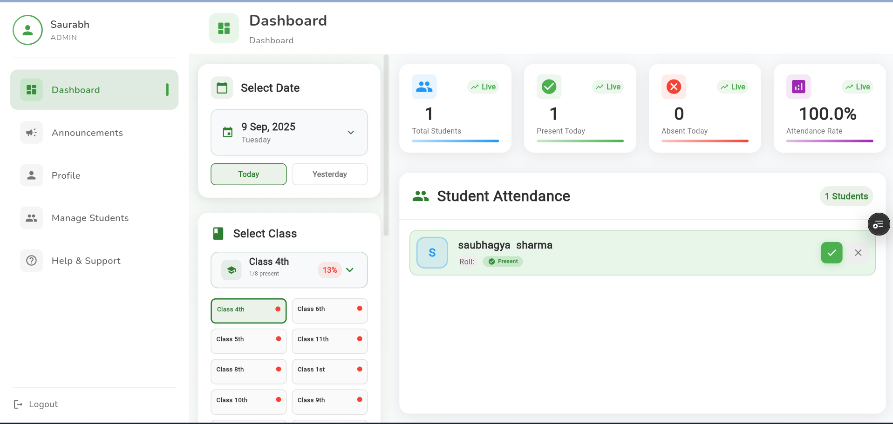
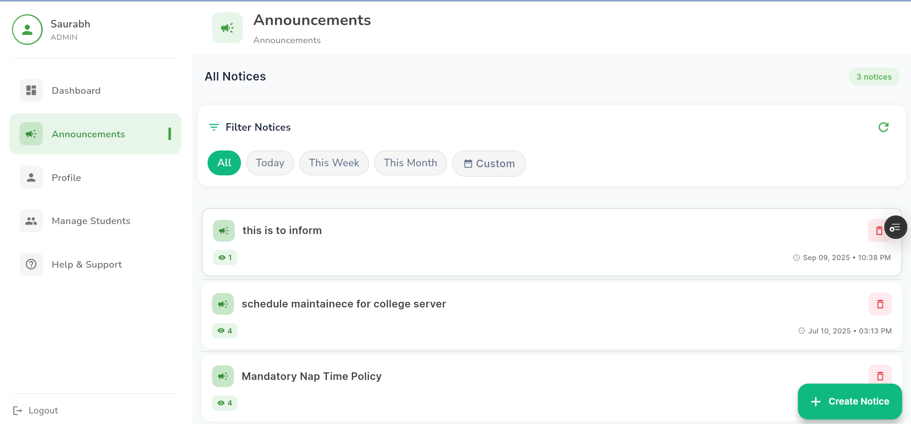
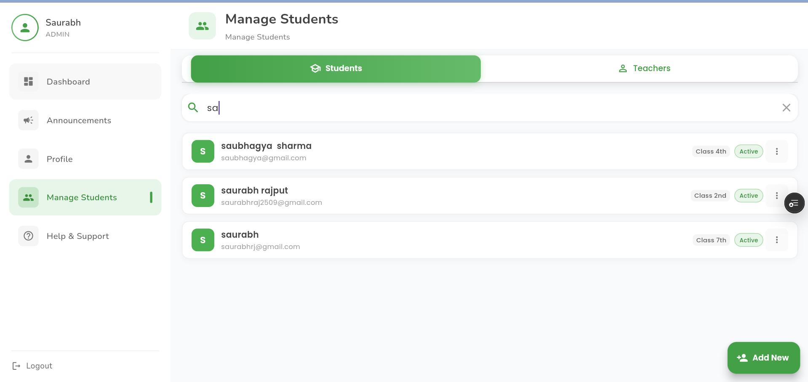
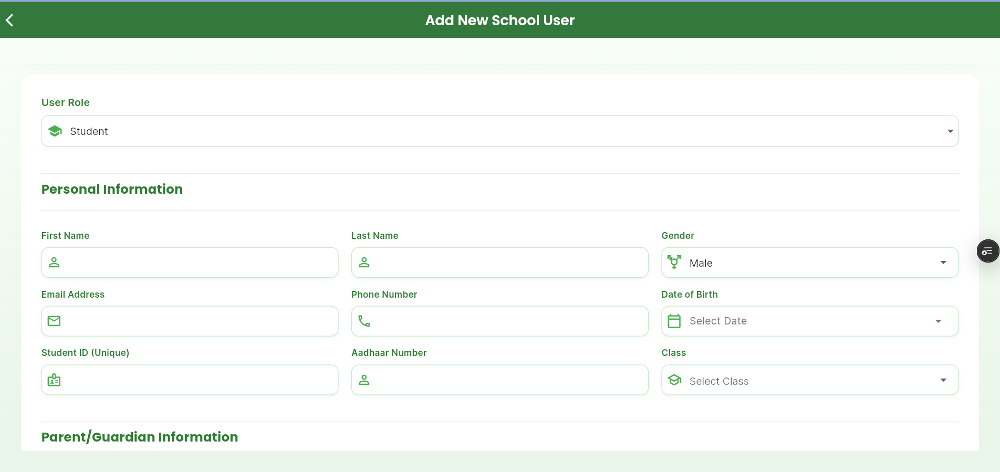
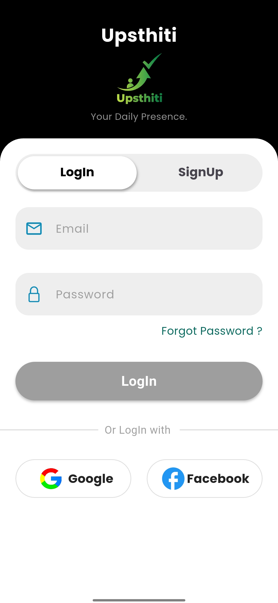
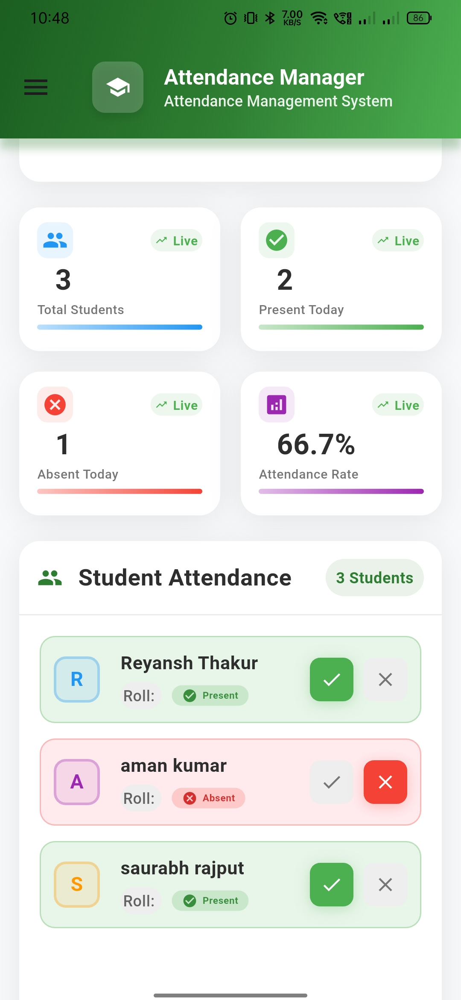
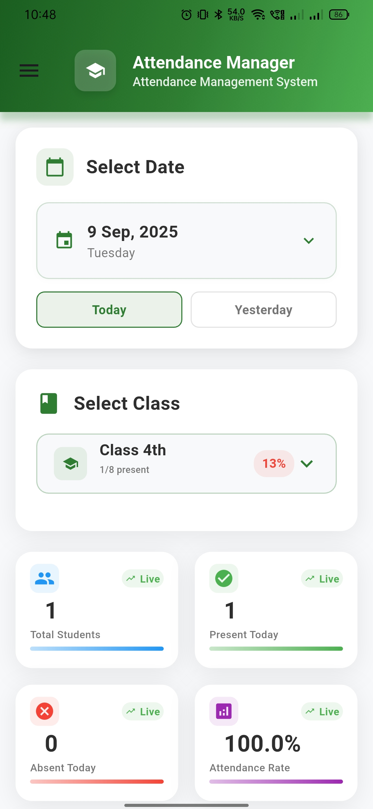
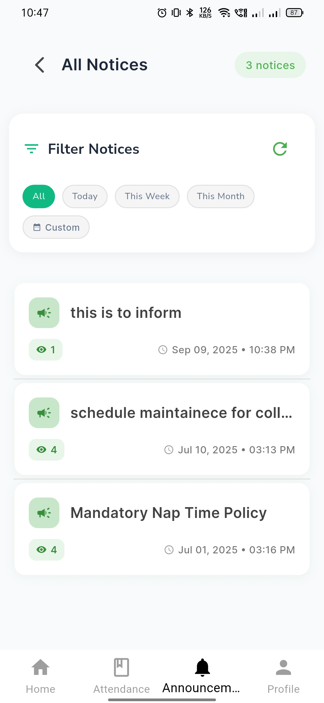
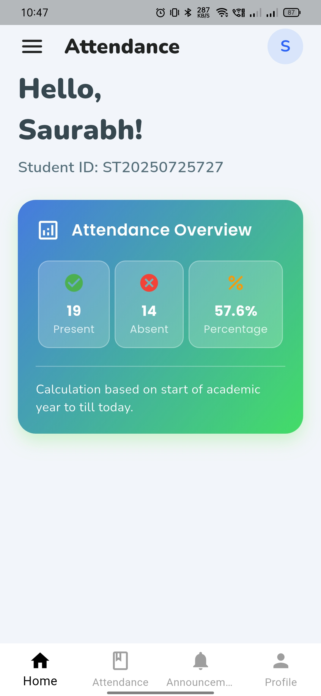

# 📘 Upasthiti - Smart Attendance System


---

## 🚀 About the Project
**Upasthiti** is a modern attendance management system built with **Flutter + Firebase**.  
It allows teachers, students, and admins to interact seamlessly with attendance records, schedules, and notifications in real-time.

---

## ✨ Features
- 👩‍🏫 Teacher login with **unique ID approval**   
- ✅ Mark attendance daily   
- 🧑‍💻 Admin panel with **role-based access (Admin / Teacher)**  
- 🔔 Push notifications & notice board system  
- 📊 Responsive **dashboard UI** (mobile, tablet, desktop)  
- 🌙 Modern **green-themed design**  

---

## 🛠️ Tech Stack
- **Frontend**: Flutter (Dart)  
- **Backend**: Firebase (Auth, Firestore, Cloud Messaging)  
- **State Management**: BLoC  
- **Navigation**: GoRouter  

---

## App logo

<p align="center">
  
</p>

## 📸 Screenshots


<p align="center">
  
  
  
  
  
  
</p>

## Moblie Phone Screentshots

<p align="center">
  
  
  
  
  
  
  
</p>

---

## ⚙️ Installation

### 1. Clone the repo
```bash
git clone https://github.com/Dev-saurabhrah/upasthiti.git
cd upasthiti
